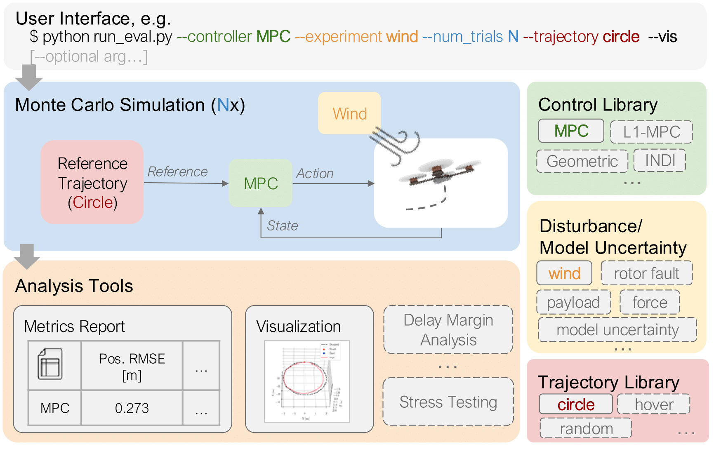

# AdaptiveQuadBench



*Figure from our paper: [A Simulation Evaluation Suite for Robust Adaptive Quadcopter Control](https://arxiv.org/abs/2510.03471)*

AdaptiveQuadBench is a standarized testbed for adaptive quadrotor controllers, built on top of the RotorPy simulator. It provides implementations of various adaptive control strategies and tools to evaluate their performance under different disturbances and conditions.

## Features

- Multiple adaptive controller implementations (Geometric, L1, MPC, INDI, etc.)
- Standardized evaluation framework for controller comparison
- Support for various disturbances (wind, force, torque, parameter uncertainty)
- Parallel simulation capabilities for efficient benchmarking
- Visualization tools for performance analysis

## Installation

### Prerequisites

- Python 3.8 or higher
- Conda package manager
- Git

### Installation Steps

1. Clone the repository and initialize submodules:
   ```bash
   git clone https://github.com/Dz298/AdaptiveQuadBench.git
   cd AdaptiveQuadBench
   git submodule update --init --recursive
   ```

2. Create and activate the conda environment:
   ```bash
   conda env create -f environment.yaml
   conda activate quadbench
   ```

3. If you plan to use MPC controllers, install acados following these steps:

   **Step 1: Clone acados repository**
   ```bash
   git clone https://github.com/acados/acados.git
   cd acados
   git submodule update --recursive --init
   ```

   **Step 2: Build and install acados**
   ```bash
   mkdir -p build
   cd build
   cmake -DACADOS_WITH_QPOASES=ON ..
   make install -j4
   ```

   **Step 3: Install Python interface**
   ```bash
   pip install -e <acados_root>/interfaces/acados_template
   ```
   Note: Replace `<acados_root>` with the actual path to your acados directory.

   **Step 4: Set environment variables**
   ```bash
   export LD_LIBRARY_PATH=$LD_LIBRARY_PATH:"<acados_root>/lib"
   export ACADOS_SOURCE_DIR="<acados_root>"
   ```
   Note: On MacOS, use `DYLD_LIBRARY_PATH` instead of `LD_LIBRARY_PATH`.
   
   **Step 5: Verify installation**
   ```bash
   cd <acados_root>/examples/acados_python/getting_started/
   python minimal_example_ocp.py
   ```
   If this runs without errors, your acados installation is working correctly.

   **Step 6: Make environment variables permanent (optional)**
   Add the export commands to your `~/.bashrc` or `~/.zshrc` file to avoid setting them every time you open a new terminal.

## Usage

### Running Experiments

To run a basic experiment comparing different controllers:

```bash
python run_eval.py --controller geo geo-a l1geo --experiment wind --num_trials 100
```

Available options:
- `--controller`: Controller types to evaluate (geo, geo-a, l1geo, l1mpc, indi-a, xadap, mpc, all)
- `--experiment`: Experiment type (wind, uncertainty, force, torque, rotoreff)
- `--num_trials`: Number of trials to run
- `--trajectory`: Trajectory type (random, hover, circle)
- `--save_trials`: Save individual trial data
- `--serial`: Run in serial mode (default is parallel)
- `--vis`: Visualize a single trial without saving data

### Finding Controller Limits

To find the failure point of controllers by gradually increasing disturbance intensity:

```bash
python run_eval.py --controller geo geo-a --experiment wind --when2fail --max_intensity 10.0
```

### Finding Delay Margin

To evaluate the robustness of controllers to time delays, you can run the delay margin analysis:

```bash
python run_eval.py --controller geo geo-a l1geo --delay_margin
```

### Visualizing Results

Results are saved in the `data` directory and can be visualized using the included visualization tools.


## Citation

If you use AdaptiveQuadBench in your research, please cite:

```bibtex
@misc{zhang2025simulationevaluationsuiterobust,
      title={A Simulation Evaluation Suite for Robust Adaptive Quadcopter Control}, 
      author={Dingqi Zhang and Ran Tao and Sheng Cheng and Naira Hovakimyan and Mark W. Mueller},
      year={2025},
      eprint={2510.03471},
      archivePrefix={arXiv},
      primaryClass={cs.RO},
      url={https://arxiv.org/abs/2510.03471}, 
}
```

Additionally, please cite the specific controller implementations you use:

* Baseline Controllers
  * Geometric Control described in [Lee CDC'10](https://doi.org/10.1109/CDC.2010.5717652)
  * Model Predictive Control described in [Sun TRO'22](https://arxiv.org/abs/2109.01365)

* Adaptive Controllers
  * Geometric Adaptive Controller described in [Goodarzi JDSMC'15](https://doi.org/10.1115/1.4030419)
  * L1 Adaptive Geometric Controller described in [Wu arXiv'23](https://arxiv.org/abs/2302.07208)
  * L1 Adaptive MPC described in [Tao ACC'24](https://doi.org/10.23919/ACC60939.2024.10644611)
  * Adaptive INDI described in [Smeur JGCD'15](https://doi.org/10.2514/1.G001490) and [Tal TCST'21](https://doi.org/10.1109/TCST.2020.3001117)
  * Learning-based Extreme Adaptation Controller described in [Zhang TRO'25](https://doi.org/10.1109/TRO.2025.3577037)


## License

This project is licensed under the MIT License - see the [LICENSE](LICENSE) file for details.

## Acknowledgments

- [RotorPy](https://github.com/spencerfolk/rotorpy) for the quadrotor simulation framework
- Contributors to the various control algorithms implemented in this repository